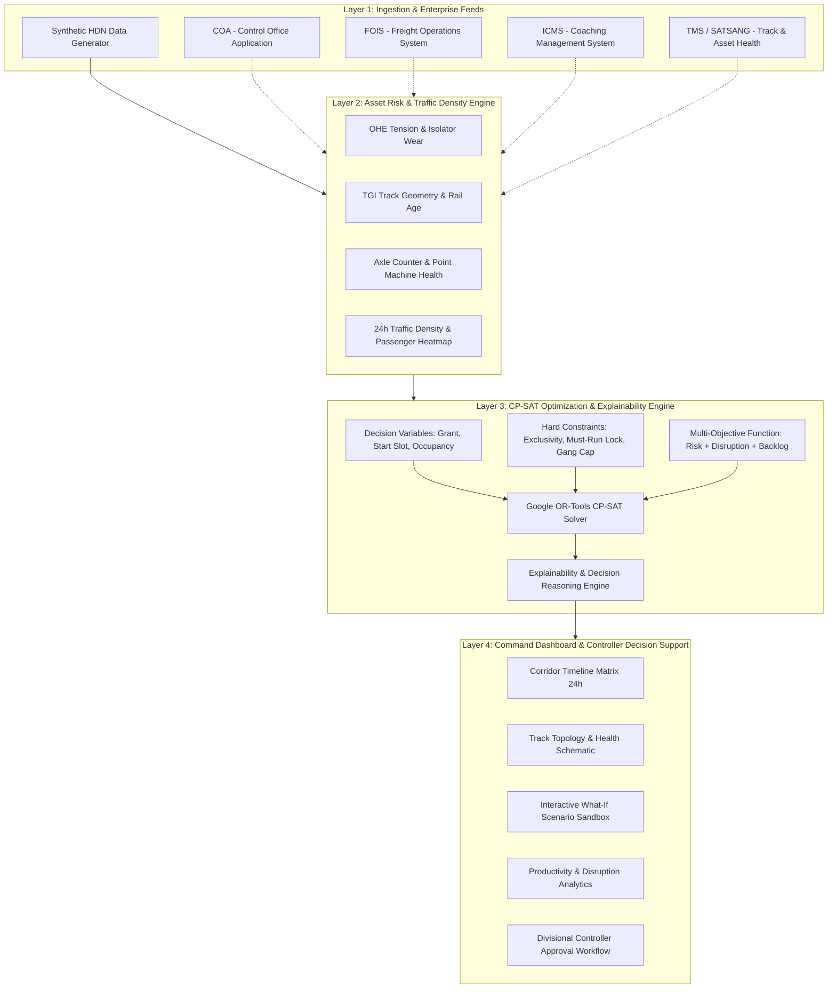

# Indian Railways Automatic Block Planning Architecture (SIH26027)

## Overview
The **AI-Powered Automatic Block Planning System** solves the foundational operational conflict on Indian Railways: balancing track infrastructure maintenance access ("traffic blocks") demanded by engineering departments against passenger and freight train operations.

This document describes the 4-layer architecture of the prototype and provides the production integration roadmap for Indian Railways enterprise systems.

---

## The 4-Layer System Architecture

---

### Layer 1: Ingestion & Data Layer
- **Prototype Implementation**: `backend/app/generator.py` generates a deterministic, realistic High-Density Network (HDN) corridor across 11 stations (New Delhi to Pt. Deen Dayal Upadhyaya Jn), 11 track sections, 44 scheduled trains (Vande Bharat, Rajdhani, Shatabdi, Superfast, and Freight rakes), and 38 multi-department block requests.
- **Production IR Integration**:
  1. **COA (Control Office Application)**: Ingests real-time section occupancy, TSR (Temporary Speed Restrictions), and live train movements.
  2. **FOIS (Freight Operations Information System)**: Ingests freight rake paths, coal/container rakes, and flexible freight windows.
  3. **ICMS (Integrated Coaching Management System)**: Ingests master timetables, rake links, and premium must-run schedules.
  4. **TMS (Track Management System) / SATSANG**: Ingests automated Track Recording Car (TRC) geometry runs, rail fracture history, and overdue maintenance work orders.

---

### Layer 2: Asset Risk & Traffic Density Scoring Engine
- **Composite Risk Formulation**:
  $$\text{AssetRisk}(s) = 1.5 \times \left(100 - (0.45 \cdot H_{\text{P-Way}} + 0.30 \cdot H_{\text{TRD}} + 0.25 \cdot H_{\text{Signal}})\right) + \text{OverduePenalty}(\text{days})$$
  - High risk ($>70$) sections force priority access in solver objective.
- **Traffic Disruption Cost**:
  $$\text{DisruptionCost}(s, t) = 45 \cdot N_{\text{passenger}}(s, t) + 12 \cdot N_{\text{freight}}(s, t) + 18 \cdot \text{Density}(s, t)$$
  - Identifies natural **maintenance valleys** (e.g., 01:00 to 05:00 hrs) where disruption cost drops by 80%.

---

### Layer 3: Mathematical Optimization Engine (Google OR-Tools CP-SAT)
- **Time Discretization**: 24 discrete hourly slots ($t \in \{0, \dots, 23\}$).
- **Decision Variables**:
  - $g_r \in \{0, 1\}$: whether request $r$ is granted.
  - $s_{r, t} \in \{0, 1\}$: whether request $r$ starts at slot $t$.
  - $u_{r, t} \in \{0, 1\}$: whether request $r$ occupies section $s(r)$ at slot $t$.
  - Relationship: $u_{r, t} = \sum_{\tau = \max(0, t - d_r + 1)}^{t} s_{r, \tau}$ and $\sum_{t} s_{r, t} = g_r$.

- **Hard Constraints**:
  1. **Track Section Exclusivity (No Double Booking)**:
     $$\sum_{r \in R(s)} u_{r, t} \le 1 \quad \forall s, \forall t$$
  2. **Must-Run Train Protection**:
     $$u_{r, t} = 0 \quad \forall (s, t) \text{ where } \text{MustRunTrainActive}(s, t) = \text{True}$$
  3. **Network Crew / Machine Quota**:
     $$\sum_{r \in R} u_{r, t} \le \text{CrewLimit} \quad (\text{default: } 4 \text{ gangs}) \quad \forall t$$
  4. **Contiguous Duration**:
     If $g_r = 1$, block occupies exactly $d_r$ contiguous slots.

- **Objective Function**:
  $$\text{Minimize} \quad \sum_{r} W_{\text{risk}} \cdot (1 - g_r) \cdot \text{CompositeRisk}_r + \sum_{r, t} W_{\text{disrupt}} \cdot u_{r, t} \cdot \text{DisruptionCost}(s(r), t) + \sum_{r} W_{\text{backlog}} \cdot (1 - g_r) \cdot C_{\text{backlog}} + \text{WindowPenalty}$$

- **Explainability Engine (`backend/app/explainability.py`)**:
  - For every grant: reports the specific traffic valley, passenger trains bypassed, and asset risk mitigated.
  - For every rejection: pinpoints the bottleneck (Must-run train conflict, competing higher-urgency request, or crew quota exhaustion).

---

### Layer 4: Operations Dashboard & Controller Decision Support
- **Corridor Master Timeline Matrix**: Visualizes sections (Y-axis) against 24 hours (X-axis) with department-coded blocks and must-run train overlays.
- **Explainability Inspector**: Deep-dive side panel breaking down mathematical drivers and constraint satisfaction audits.
- **What-If Scenario Sandbox**: Real-time slider controls for $W_{\text{risk}}$, $W_{\text{disrupt}}$, crew quotas, and demand escalation with instant re-optimization.
- **Network Topology & Analytics**: Schematic station-track view and Recharts departmental breakdown.

---

## Enterprise Production Integration Blueprint

| System | Role in Production | Data Exchange Format |
|---|---|---|
| **CRIS COA** | Real-time train positions & section block execution | Kafka Event Streams / REST JSON |
| **FOIS** | Freight rake demands & terminal turnaround | MQ / REST API |
| **ICMS** | Passenger train schedules & special trains | Daily batch / Webhooks |
| **TMS (SATSANG)** | Track Recording Car (TRC) data, rail ultrasonic flaw detection (USFD) | Spatial GIS / GeoJSON |
| **Divisional Control (DOM/Sr.DEN)** | Master block plan approval & line clear dispatch | Web Dashboard / Role-Based Token Auth |
